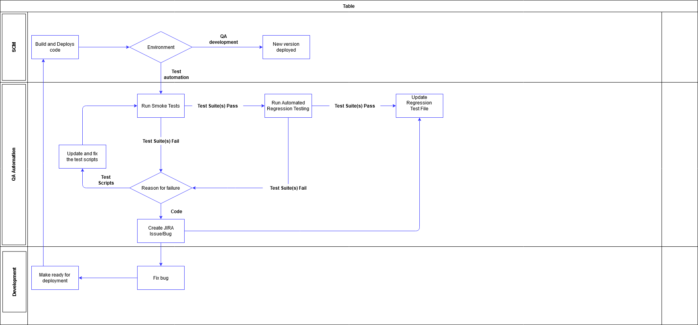

# 1 Introduction

This test plan describes the testing approach and overall framework that are used to drive the testing of the API.

MB API consists of the following:

    * Create Account
    * Get balances
    * Create transactions
    * Initialize and confirm payments

# 2 Objective

The objective of the tests is to identify any possible bugs in the functionality of the product and to verify 
that the product behaves as expected. Both of these objectives are accomplished through test automation. 
Continuous integration is also used in order to prevent running into integration errors.

# 3 Test Strategy

This section will cover the different types of tests that are performed during the testing process cycle.

    *Unit Testing
    *Integration Testing
    *Regression Testing
    *Performance Testing
    
# 4 Testing Process

## 4.1 Software Testing Process
This section outlines each software testing process that is implemented during the specified stages of the development process

### 4.1.1 Unit testing
Prior to development, unit-level test cases and expected results are identified to support the functional interfaces being declared and the expected behaviors of those interfaces.  During development, the team member will implement these interfaces and run the test driver on the product, verifying the expected results against each case before declaring the development task complete.

### 4.1.2 Integration testing
The purpose of this level of testing is to expose faults in the interaction between integrated units.

### 4.1.3 Regression testing
The purpose of this level of testing is to confirm that a recent program or code change has not adversely affected existing features. 

### 4.1.4 Performance testing
Types of Performance Testing:

    *Load testing - checks the application's ability to perform under anticipated user loads. The objective is to identify performance bottlenecks before the software application goes live.
    *Stress testing - involves testing an application under extreme workloads to see how it handles high traffic or data processing. The objective is to identify the breaking point of an application.
    *Scalability testing - The objective of scalability testing is to determine the software application's effectiveness in "scaling up" to support an increase in user load. It helps plan capacity in addition to your software system.
    
## 4.2 Testing Process Workflow

## 4.3 CI/CD Pipeline
1 Merge request (MR) in Git

1.1 Git notifies CI via webhook

2 CI builds the MR branch

2.1 Runs fast automated tests

2.2 Reports results (e.g Jenkins send report)

3 MR is reviewed and merged to Master branch

4 Code commit to Master branch

5 Git notifies CI via webhook

6 CI builds the master Branch

6.2 Runs Automated Tests

6.3 Runs slower tests

6.4 Jenkins make test report

# 5 Problem Reporting

When bugs are found outside of in-phase testing, the following steps are followed to capture the issue:

    * Create a JIRA issue/bug in the backlog.
    * Fill out appropriate fields including Affect Version(s) and thorough description.
    * Development Team resolves the issue in priority order.

# 6 Environment & Test Tools

* Jenkins v2.235.1 Used to run the automated testing and generate test artifacts
* Rest-assured v3.0.0. Used to develop automated tests.
* Gradle v6.5.1. Used to manage dependencies.

	
# Main test areas

* Create Account

* Create Transaction

* Get Balance

* Initialize and confirm payments

The following should be tested:

    * JSON respons/request structure
    * Authentication Token
    * Error Messages
    * Error handling 
    * Basic security tests
    * Make example code of using API
